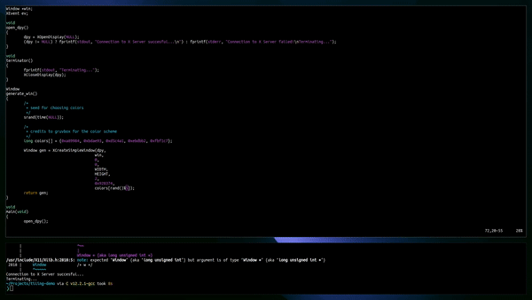

# fibonacci-dwindle-demo
A demo of a tiling window manager for X11 using Fibonacci Dwindle layout.

> tiling-demo

# Description

This is a rough demo of how a Fibonacci tiling window manager works in dwindle layout. It supports a maximum of 4 windows at once on the screen.
The algorithm itself is simple, the first window uses half the screen, the second half of the remainder and so on.
This project was created solely to recap essential C notions, as I haven't done any programming in a while.
Expect some interesting projects soon!

The colors used are from [gruvbox](https://github.com/morhetz/gruvbox).
